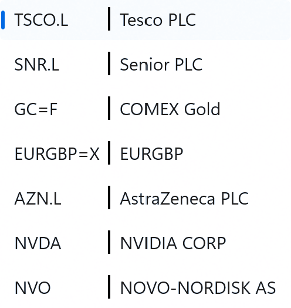

# IntelligentOne
The IntelligentOne is a platform for Model development for the Capital Markets, applying Machine Learning(ML) techniques, Microsoft ML.Net technology, Quantitative techniques, and Sentiment analysis. It automatically performs the data engineering required to calculate the Technical and Fundamentals Indicators, using historical prices, and income, balance sheet and cashflow statements. The AutoML system examines different machine learning algorithms, finds the best algorithm, and build best trained models. The User Interface(UI) combines the charts and trained models to make predictions.

The platform was verified against the following data types: stock, gold, and currency pair instruments.

### Technical Indicators/Charts
#### Bollinger Bands(BB)

#### Moving Average Convergence Divergence(MACD)

#### Fast Stochastic Oscillator(FSO) 

#### Williams %R(%R) 

#### Relative Strength Index(RSI) 

#### On Balance Volume(OBV)

#### Moving Average (MA)

#### Average Directional Index(ADX)

### The Model Builder
The ML model builder is a console application which is configurable. It creates a factory for each instrument and uses the AutoML.Net library to build/train/evaluate the best model for each indicator.

Identifying the right features influences the quality and performance of the ML algorithms. 
The Model Builder support the following tools:

#### The Pearson correlation coefficient
The training data sets can be checked for the correlation between different properties.

#### The Linearly separability
There are several classification algorithms that are designed to separate the data by constructing a linear decision Boundary 
(hyperplane) to divide the classes. The data sets can be checked for linearly separability or not by constructing their convex hulls.

